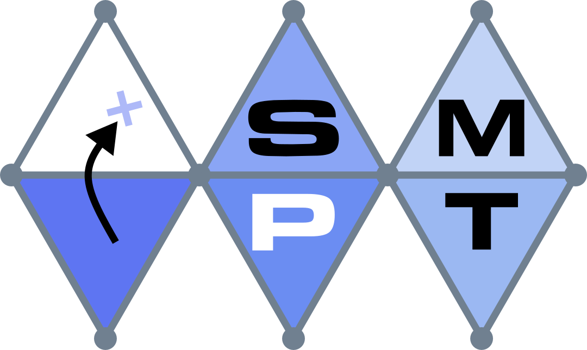

# SM(P/)T - *Satisfiability Modulo Petri Net*

<br />
<p align="center">
  <a href="https://github.com/nicolasAmat/SMPT">
    
  </a>
</p>

## About

SMPT is a SMT-based model checker for Petri nets focused on *reachability*
problems that takes advantage of net reductions (*polyhedral reductions*). 

## Installation

### Requirements

* Python >= 3.7 (we highly recommend version 3.7.12)
  + (Optional) [cx_Freeze](https://pypi.org/project/psutil/) - standalone executables generator
  + (Optional) [mypy](http://mypy-lang.org/) - static type checker
  + (Optional) [sphinx](https://www.sphinx-doc.org/en/master/index.html) - Python documentation generator
* [z3](https://github.com/Z3Prover/z3) - SMT solver
* [Tina toolbox](http://projects.laas.fr/tina/) - Friend tools
  + (Optional) [ndrio](https://projects.laas.fr/tina/manuals/ndrio.html) - Petri net converter (`.pnml` to `.net`)
  + (Optional) [reduce](https://projects.laas.fr/tina/manuals/reduce.html) - Petri net reducer
    + [struct](http://projects.laas.fr/tina/)
    + [4ti2](https://github.com/4ti2/4ti2) or [LattE integrale](https://github.com/latte-int/latte-distro)
  + (Optional) [walk](https://projects.laas.fr/tina/manuals/walk.html) - Random state space explorer
  + (Optional) [tina](https://projects.laas.fr/tina/manuals/tina.html) - State space generator
  + (Optional) [mcc](https://github.com/dalzilio/mcc) - Petri net unfolder
* (Optional) [MiniZinc](https://www.minizinc.org/) - Constraint programming solver

### Installation script

To automatically install dependencies (except Python packages and MiniZinc) you
can run the `install_dependencies.sh` script.

### Python setup

It is highly recommended to use the Python 3.7.12 version. You can use
[pyenv](https://github.com/pyenv/pyenv), a Python version management tool:

```
$ pyenv install 3.7.12
$ pyenv local 3.7.12
$ pyenv rehash 
```

### Freezing

The tool can be freezed into standalone executables using
[cx_Freeze](https://cx-freeze.readthedocs.io/en/latest/) by running:
```
$ python3 setup.py build
```

### Type checking

The typing of the code can be checked using [mypy](http://mypy-lang.org/) by
running:
```
$ mypy smpt --no-strict-optional
```

### Documentation generation

The html documentation can be generated using the sphinx generator by running:
```
$ cd docs
$ make html
```

## Running the model checker

### Input formats

The tool takes as input descriptions in `.pnml` ([Petri Net Markup
Language](https://www.pnml.org/)) and `.net` format (textual format for Petri
nets described in [the
Tina man pages](http://projects.laas.fr/tina/manuals/formats.html)).  

The path to the input Petri net must be specified using the `-n <path>` option.  

SMPT supports the verification of several kind of reachability properties on Petri nets.  
For instance, the following call can be used to check for the existence of
deadlocked states on model `Kanban-00002.net`.

```
$ python3 -m smpt -n nets/Kanban/Kanban-00002.net --deadlock --methods BMC
```

The tools also supports colored Petri nets. In this case, use the option
`--colored` and install the [mcc](https://github.com/dalzilio/mcc) tool.  

The tool supports three main kinds of properties:

* Detection of deadlocks, `--deadlock`: is there a reachable marking with no
  outgoing transitions.
* Quasi-liveness, `--quasi-liveness t`: is there a reachable marking where
transition `t` can fire. You can check the quasi-liveness of several transitions
at the same time by passing a comma-separated list of transition names:
`--quasi-liveness t1,...,tn`.
* Reachability: `--reachability p`: is there a reachable marking where place `p`
is marked (it has at least one token). You can check the reachability of several
places at once by passing a comma-separated list of place names: `--reachability
p1,...,pn`.

The tool also supports properties from the [MCC properties format](https://mcc.lip6.fr/pdf/MCC2020-formula_manual.pdf)
by using the option `--xml` and indicating the path to the `.xml` properties file.
At this time, the support is restricted to:
+ `--xml GlobalProperties.xml`
+ `--xml ReachabilityCardinality.xml`
+ `--xml ReachabilityFireability.xml`

### Polyhedral reductions

For methods that relies on polyhedral reductions, it is possible to
automatically compute the reduction (`--auto-reduce`) or to provide a
pre-computed version with option `--reduce <path>`. It is also possible to save
a copy of the reduced net with the option `--save-reduced-net <path>`.  

Some examples of nets with their corresponding reductions are available in
`nets/E-Abstraction/`.

### Output format

Results are printed in the text format required by the Model Checking Contest
(MCC) which is of the form:
```
FORMULA <id> (TRUE/FALSE)
```

Some options permits to obtain more information:
+ `--verbose` or `-v`: evolution of the methods
+ `--debug`: input/output SMT-LIB exchanged with the SMT solver
+ `--show-techniques`: returns the methods that successfully computed a verdict
+ `--show-time`: print the execution time per property
+ `--show-reduction-ratio`: get the reduction ratio
+ `--show-model`: print the counterexample if it exists
+ `--check-proof`: check the certificate of invariance (if we have one)
+ `--export-proof`: export verdict certificates (inductive invariants (SMT-LIB),
  trace leading to counterexamples
  ([`.scn`](https://projects.laas.fr/tina/manuals/formats.html#14) format),
  etc.)

### Verification methods

The tool is composed of different methods:
+ `INDUCTION`: a basic method that checks if a property is an inductive
invariant. This property is *easy* to check, even though interesting
properties are seldom inductive.
+ `BMC`: Bounded Model Checking is an iterative method to explore the state
space of systems by unrolling their transitions. This method is only useful for
finding counterexamples.
+ `K-INDUCTION`: is an extension of BMC that can also prove invariants.
+ `PDR-COV`, `PDR-REACH` and `PDR-REACH-SATURATED`: Property Directed
Reachability, also known as IC3, is a method to strengthen a property that is
not inductive, into an inductive one. This method can return a verdict
certificate. We provide three different methods of increasing complexity (cf.
\[TACAS2022\]) (one for coverability and two for general reachability).
+ `STATE-EQUATION`: is a method for checking that a property is true for all
*potentially reachable markings* (solution of the state equation). We
implement a refined version that can over-approximate the result with the help
of trap constraints and other structural information, such as NUPN
specifications.
+ `WALK`:  relies on simulation tools to quickly find counterexamples. We
currently use `walk` that is distributed with the [Tina
toolbox](http://projects.laas.fr/tina/).
+ `SMT` and `CP`:  are methods specific to SMPT in the case where nets are
*fully reducible* (the reduced net has only one marking). In this case,
reachable markings are exactly the solution of the reduction equations and
verdicts are computed by solving linear system of equations.

Depending on the input net, SMPT runs a subset of these methods in parallel.  
You can restrict the choice of the verification methods with  `--methods
<method_1> ... <methods_n>`.

The `--auto-enumerative` and `--enumerative <path>` (where the path leads to the
list of markings into the [.aut format](https://projects.laas.fr/tina/manuals/formats.html)) perform an
exhaustive exploration of the state space.

### Tweaking options

We provide a set of options to control the behavior of our verification jobs scheduler such as:
+ `--global-timeout <int>`: add a timeout
+ `--timeout <int>`: add a timeout per property
+ `--mcc`: puts the tool in *competition mode*

### Usage

You can list all the options by using the *help* option:
```
$ smpt --help
usage: __main__.py [-h] [--version] [-v] [--debug] -n ptnet [--colored]
                   [--xml PATH_PROPERTIES | --deadlock | --quasi-liveness QUASI_LIVE_TRANSITIONS | --reachability REACHABLE_PLACES]
                   [--auto-reduce | --reduced PATH_PTNET_REDUCED]
                   [--save-reduced-net]
                   (--methods [{WALK,STATE-EQUATION,INDUCTION,BMC,K-INDUCTION,PDR-COV,PDR-REACH,PDR-REACH-SATURATED,SMT,CP,TIPX} [{WALK,STATE-EQUATION,INDUCTION,BMC,K-INDUCTION,PDR-COV,PDR-REACH,PDR-REACH-SATURATED,SMT,CP,TIPX} ...]] | --auto-enumerative | --enumerative PATH_MARKINGS)
                   [--project]
                   [--timeout TIMEOUT | --global-timeout GLOBAL_TIMEOUT]
                   [--skip-non-monotonic] [--show-techniques] [--show-time]
                   [--show-reduction-ratio] [--show-model] [--check-proof]
                   [--export-proof PATH_PROOF] [--mcc]

SMPT: Satisfiability Modulo Petri Net

optional arguments:
  -h, --help            show this help message and exit
  --version             show the version number and exit
  -v, --verbose         increase output verbosity
  --debug               print the SMT-LIB input/ouput
  -n ptnet, --net ptnet
                        path to Petri Net (.net or .pnml format)
  --colored             colored input Petri net
  --xml PATH_PROPERTIES
                        use XML format for properties
  --deadlock            deadlock analysis
  --quasi-liveness QUASI_LIVE_TRANSITIONS
                        liveness analysis (comma separated list of transition
                        names)
  --reachability REACHABLE_PLACES
                        reachibility analysis (comma separated list of place
                        names)
  --auto-reduce         reduce automatically the Petri Net (using `reduce`)
  --reduced PATH_PTNET_REDUCED
                        path to reduced Petri Net (.net format)
  --save-reduced-net    save the reduced net
  --methods [{WALK,STATE-EQUATION,INDUCTION,BMC,K-INDUCTION,PDR-COV,PDR-REACH,PDR-REACH-SATURATED,SMT,CP,TIPX} [{WALK,STATE-EQUATION,INDUCTION,BMC,K-INDUCTION,PDR-COV,PDR-REACH,PDR-REACH-SATURATED,SMT,CP,TIPX} ...]]
                        enable methods among WALK STATE-EQUATION INDUCTION BMC
                        K-INDUCTION PDR-COV PDR-REACH PDR-REACH-SATURATED SMT
                        CP TIPX
  --auto-enumerative    enumerate automatically the states (using `tina`)
  --enumerative PATH_MARKINGS
                        path to the state-space (.aut format)
  --project             Use TFG projection for WALK, TIPX, K-INDUCTION
  --timeout TIMEOUT     a limit per property on execution time
  --global-timeout GLOBAL_TIMEOUT
                        a limit on execution time
  --skip-non-monotonic  skip non-monotonic properties
  --show-techniques     show the method returning the result
  --show-time           show the execution time
  --show-reduction-ratio
                        show the reduction ratio
  --show-model          show a counterexample if there is one
  --check-proof         check and show the certificate of invariance if there
                        is one
  --export-proof PATH_PROOF
                        export the proof of invariance if there is one
  --mcc                 Model Checking Contest mode
```

## Disk images

Complete installations of SMPT can be found in the MCC disk images (see the [Tool Submission Kit](https://mcc.lip6.fr/archives/SubmissionKit-2022.tar.gz) for more information):
+ MCC'2022: [smpt-2022.tar.gz](https://mcc.lip6.fr/archives/smpt-2022.tar.gz)
+ MCC'2021: [smpt-2021.vmdk.tar.gz](https://mcc.lip6.fr/2021/archives/smpt-2021.vmdk.tar.bz2)

You can also download the artifact of our [TACAS2022] paper that contains all
the material to install the tool and reproduce the experiments:
+ [SMPT_TACAS_2022.zip](https://zenodo.org/record/5863379/files/SMPT_TACAS_2022.zip?download=1)

## Awards

SMPT, won a bronze medal in the “reachability” category of the Model Checking
Contest 2022, an international competition of model checking tools for the
verification of concurrent systems. It also obtains the 100% confidence award.

<br />
<p align="center">
  <a href="https://mcc.lip6.fr/">
    
  </a>
</p>

## References

+ Nicolas Amat, Silvano Dal Zilio, Thomas Hujsa. Property Directed Reachability
  for Generalized Petri Nets. *28th International Conference on Tools and
  Algorithms for the Construction and Analysis of Systems. (TACAS 2022)*, Apr
  2022, Munich, Germany.  
+ Nicolas Amat, Bernard Berthomieu, Silvano Dal Zilio. On the Combination of
  Polyhedral Abstraction and SMT-based Model Checking for Petri nets. *42rd
  International Conference on Application and 
  Theory of Petri Nets and Concurrency (Petri Nets 2021)*, Jun 2021, Paris (virtual), France. 
+ F. Kordon and P. Bouvier and H. Garavel and F. Hulin-Hubard and N. Amat. and
  E. Amparore and B. Berthomieu and D. Donatelli and S. Dal Zilio and P. G.
  Jensen and L. Jezequel and  C. He and S. Li and E. Paviot-Adet and J. Srba and
  Y. Thierry-Mieg, Complete Results for the 2022 Edition of the Model Checking
  Contest, June 2022
+ F. Kordon and P. Bouvier and H. Garavel and L. M. Hillah and F. Hulin-Hubard
	and N. Amat. and E. Amparore and B. Berthomieu and S. Biswal and D. Donatelli
	and F. Galla and and S. Dal Zilio and P. G. Jensen and  C. He and D. Le Botlan
	and S. Li and and J. Srba and . Thierry-Mieg and A. Walner and K. Wolf,
	Complete Results for the 2021 Edition of the Model Checking Contest, June
	2021.

## Dependencies

The code repository includes copies of models taken from the [MCC Petri Nets
Repository](https://pnrepository.lip6.fr/) located inside folder  `nets/`.

## License

This software is distributed under the
[GPLv3](https://www.gnu.org/licenses/gpl-3.0.en.html) license.
A copy of the license agreement is found in the [LICENSE](./LICENSE) file.

## Authors

* **Nicolas AMAT** -  [LAAS/CNRS](https://www.laas.fr/)
* **Bernard BERTHOMIEU** - [LAAS/CNRS](https://www.laas.fr/)
* **Silvano DAL ZILIO** - [LAAS/CNRS](https://www.laas.fr/)
* **Didier LE BOTLAN** - [LAAS/CNRS](https://www.laas.fr/)

We are grateful to Yann THIERRY-MIEG for making [MCC'2021
oracles](https://github.com/yanntm/pnmcc-models-2021) available, and to the
members of the Model Checking Contest committees.

